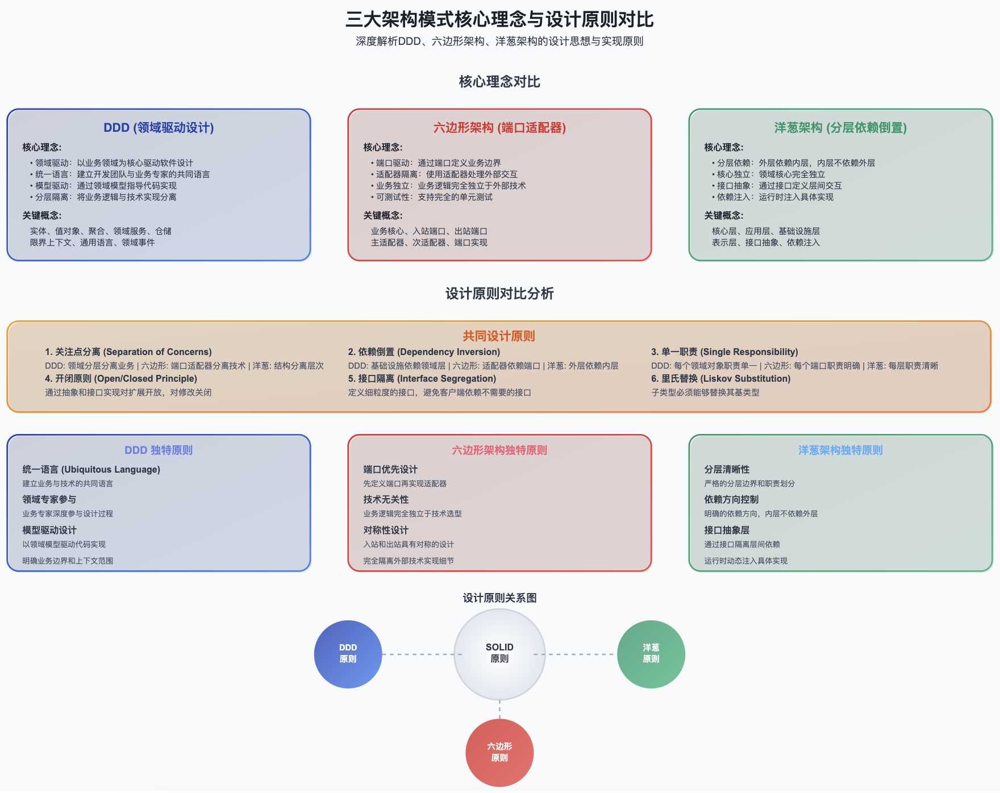

# 项目分层

> ## Excerpt
> 最开始的时候我推崇 MVC，后来大项目上我比较喜欢「洋葱架构」。一般的项目我还是选用的是 MVC，原因很简…

---
**最开始的时候我推崇`MVC`，后来大项目上我比较喜欢`洋葱架构`。**

**一般的项目我还是选用的是 MVC，原因很简单就是结构清晰，大家一眼能看懂，不需要培训。**

不过后来随着技术的发展，逐渐接触了：DDD、洋葱架构和六边形架构的分层设计方案。

**1、DDD 领域驱动设计**

**DDD**（domain driven design），2003 年提出，是一种为复杂需求开发软件的方法，强调将复杂的业务逻辑放在领域层，通过领域模型来驱动整个应用的设计，也为后续架构模式奠定了理论基础。

**分层目录结构**

**2、六边形架构**

**六边形架构 (Hexagonal Architecture) ，**也称为端口和适配器架构，由 Alistair Cockburn 于 2005 年提出，它的设计理念就是像六边形那样，把系统核心（业务逻辑）包裹在中间，周围的每个“边”都是一个端口，用来和外界通讯。外部系统要想跟核心打交道，必须通过这些端口来适配。

六边形架构将系统分为内部（内部六边形）和外部，内部代表应用的业务逻辑，外部代表应用的驱动逻辑、基础设施或其他应用。内部通过端口和外部系统通信，端口代表了一定协议，以 API 呈现。一个端口可能对应多个外部系统，不同的外部系统需要使用不同的适配器，适配器负责对协议进行转换。这样就使得应用程序能够以一致的方式被用户、程序、自动化测试、批处理脚本所驱动，并且可以在与实际运行的设备和数据库相隔离的情况下进行开发和测试

**分层目录结构**

**六边形架构核心特点**

**1）只有两个世界**

在六边形里面是所有的业务模式/逻辑，外面则是基础设施，也就是代表所有技术规范。两者之间通过端口或适配器组件联系。端口根据调用请求方向又分 API 和 SPI 两种，请求先调用 API 端口，进入领域层核心后，领域模型需要检索数据库或第三方 API 时则是通过 SPI。适配器通过软件技术组件来实现业务领域端口和具体技术之间的适配转换。

**2）依赖关系始终从外部进入内部**，这确保了业务域的隔离，如果以后更改基础架构，业务逻辑将可以重用。

**3、洋葱架构**

**洋葱架构 (Onion Architecture)，**由 Jeffrey Palermo 于 2008 年提出，强调依赖倒置原则，内层不依赖外层，所有依赖都指向内层。

洋葱架构在端口和适配器架构的基础上贯彻了将领域放在应用中心，将驱动机制（用户用例）和基础设施（ORM、搜索引擎、第三方 API 等）放在外围的思路。洋葱架构在六边形架构的基础上加入了内部层次。

洋葱架构与六边形架构有着相同的思路，都是通过编写适配器代码将应用核心从对基础设施的关注中解放出来，避免基础设施代码渗透到应用核心之中。这样应用使用的工具和传达机制都可以轻松地替换，在一定程度上避免技术、工具或者供应商锁定。

**分层目录结构**

**4、三个架构模型对比**

三种模型架构，三种软件层次结构，三种架构已经发展 10 多年了，现在也被普遍应用于很多项目中，每种架构都有着相应的应用场景，选择哪个主要还是根据项目的具体需求。

现在也有很多人在诋毁这三种架构，诚然很多小的应用随便做做就可以了，不需要具体的分层结构，很多时候一个简单的 MVC 就够，所以具体的应用还是要看场景了。

%20%E5%A4%A7%E5%AE%B6%E7%9A%84%20C%20%E9%A1%B9%E7%9B%AE%E6%98%AF%E6%80%8E%E6%A0%B7%E5%88%86%E5%B1%82%E7%9A%84%EF%BC%9F%20-%20%E7%9F%A5%E4%B9%8E/v2-7f8445a0da6de8d3e3f2e223df0304aa_720w.jpg)

三种架构有着不同的应用场景，我用比较多的是「DDD + 洋葱架构」，其他的时候也混着用。

其实项目开发没必要太拘泥具体的架构，主打的是解决问题。

在具体的项目中，「层次混乱」、「交叉依赖」经常是困扰着大家，所以在项目构架设计阶段，团队成员要达成共识，加强培训建立代码规范和审查机制，一定要避免「过度设计」和「接口爆炸」等不利于项目进展的事情，谨记。。。
